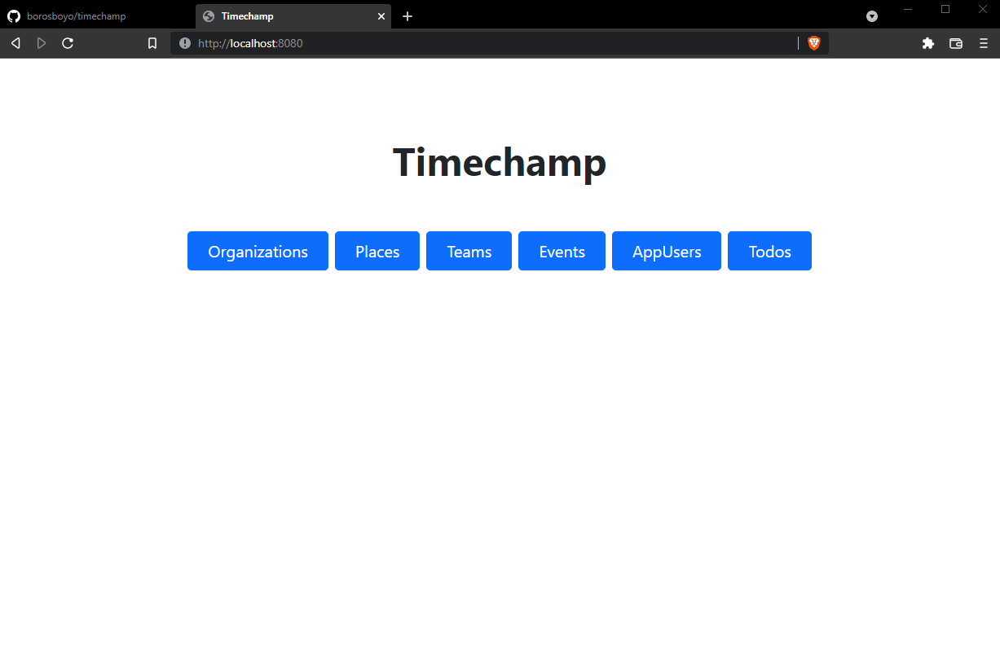

# Timechamp - Témalab 2021 beszámoló

## Az alkalmazás lokális futtatása
Megépíthetjük a `.jar` fájlt command lineból:
```
git clone https://github.com/borosboyo/timechamp.git
cd timechamp
./mvnw package
java -jar target/*.jar
```
Ezek után Timechamp elérhető lesz ezen az URL-en: http://localhost:8080/

Ezen felül akár egyből Maven-en keresztül is futtathatjuk a Spring Boot Maven plugint használva:
```
./mvnw spring-boot:run
```

Természetesen a kedvenc IDE-nkből is futtathatjuk.

Az indítás után szembesülhetünk a Thymeleafes UI-al:

`index.html`:



`appUsers.html`:


## Az alkalmazás programozói dokumentációja

### A program célja
Maga a program célja egy csapat és időpont organizációs rendszer megvalósítása **Spring Boot backenddel, teljes REST API-val és szerver oldali rendereléssel, mivel egyikünk se ért az Angularhoz**. Az applikációban csapatokat, csapattagokat és eseményeket lehet kezelni.

### A program használata

A program magába foglal organizációkat, melyeket a felhasználók hozhatnak létre, és létrehozásuk után adminisztrációs joggal rendelkeznek felette.

Az alkalmazás tartalmaz továbbá csapatokat és azok tagjait, melyek egy külön fül alatt megtekinthetőek. A felhasználók létrehozhatnak csapatot, és jelentkezhetnek is csapatokba. A csapat létrehozója elfogadhatja a csapatába jelentkező felhasználókat, továbbá már meglévőket is kirúghat belőle.

A csapat létrehozója admin joggal rendelkezik a csapaton belül, azonban más csapattagokat is felruházhat vele, továbbá csatlakozhat a csapatával egy szervezethez.

Egy csapat adminja(i) létrehozhatnak, törölhetnek csapatspecifikus eseményeket, melyre minden csapattag jelentkezni tud. Az esemény létrehozója testreszabhatja az eseményt egyedi leírás megadásával. Az eseményeknél megtekinthetőek, hogy kik a jelenlegi résztvevők. Az eseményekhez elvégzendő feladatok is kötődhetnek, amelynek vannak felelősei, illetve egy esemény helyhez kötött, amelyhez hozzá lehet rendelni Google Maps kódot, nevet, hosszúságot, illetve szélességet.

## Mit tanultunk a félév során?
### Effective Java - summary, favourites
#### 2. CREATING AND DESTROYING OBJECTS

##### 1. Use STATIC FACTORY METHODS instead of constructors
Van nevük, nem hoznak mindig létre új objektumot, bármilyen subtype-ot tudnak return-ölni.

##### 2. Use BUILDERS when faced with many constructors
Jó választás osztályok esetén, melyek konstruktorai vagy static factory-ai sok paramétert tartalmaznak. 

#### 3. METHODS COMMON TO ALL OBJECTS
##### 10. Always override toString
Egy jó toString implementáció szép, olvashatóvá teszi az osztályt. Praktikus, mert minden információt megkaphatunk belőle.

##### 12. Consider implementing Comparable
Comparable egy interface. Nincs deklarálva az Object-ben. Hasznosan jön a gyakorlatban.

#### 4. CLASSES AND INTERFACES
##### 13. Consider implementing Comparable
Jól dizájnolt module elrejti minden implementációs részletét. Elkülöníti az API-t az implementációtól.

##### 15. Minimize Mutability
Minden információ az objektumról akkor kerül megadásra, amikor létrehozzuk. Könnyebb a desing, implementáció, kevesebb az error, nagyobb a biztonság.

##### 18. Prefer interfaces to abstract classes
Java csak single-inheritencet enged meg, korlátozva az absztrakt osztályok használatát. Meglévő osztályokat könnyű retrofitelni interface-el.


#### 5. Chapter 5 - Generics

##### Item 26: Don't use raw types
Raw type-al a hibák csak runtime-ban derülnek ki. 
Generics-el a deklaráció tartalmazza a típust, és fordítási időben derülnek ki a problémák.

##### Item 27: Eliminate unchecked warnings
Generics-ekkel való dolgozás során a sok warning-ot kaphatunk.
Ha tudjuk bizonyítani, hogy a kódunk typesafe, akkor annotációval eliminálhatjuk a warning-ot.
A túl sok felesleges warning elnyomhatja a fontos warning-okat.

##### Item 28: Prefer lists to arrays
Listák használata esetén a hibák túlnyomó többsége compile időben már megjelenik, míg tömbök esetén csak futás időben.
Listákhoz sok hasznos interface van, otpimalizált implementációkkal.

##### Item 29: Favor generic types
Kliensként a használatuk ehyszerű, bár generikus osztályokat írni egy kicsit bonyolultabb.
Primitíveket csak csomagolt formában lehet használni.

##### Item 30: Favor generic methods
Generikus metódusok használata sokkal biztonságosabb, mint azoké, melyeknél explicit típuskonverziókat kell végezni.

##### Item 31: Use bounded wildcards to increase API flexibility
A legnagyobb rugalmasság érdekében használjunk wildcard típusokat a bemeneti paramétereken, 
amelyek pruducer-ek vagy consumer-ek.
PECS: producer-extends, consumer-super.

##### Item 33: Consider typesafe heterogeneous containers
Mappoknál a kulcs legyen a típusparaméteres, ne a tároló.
Típusbiztos heterogén tároló minta.


#### Chapter 6 - Enums and Annotations

##### Item 34: Use enums instead of `int` constants
Az enum típus egy olyan típus, melynek értékei fix konstansok lehetnek.
Enumokat nem lehet példányosítani, se nem lszármaztatni.
Használjunk enumokat, ha olyan kostans listára van szükégünk, melynek értékét már fordítási időben is ismerjük.

##### Item 35: Use instance fields instead of ordinals
Soha ne használjuk ki az enumok ordinalitását, sorrendjét.

##### Item 36: Use `EnumSet` instead of bit fields
A konstansok bitenkéni vagyolását váltja ki, egy biztonságosabb alternatívát nyújtva.

##### Item 37: use `EnumMap` instead of ordinal indexing
Szinte soha nem megengedhető, hogy enum ordinalitást használjunk, inább `EnumMap`-ot használjunk.

##### Item 38: Emulate extensible enums with interfaces
Bár nem lehet leszármaztatni enumokból, de lehet úgy helyettesíteni, hogy írunk egy interface-t az enumhoz, 
amely implementálja az interface-t.

##### Item 39: Prefer annotations to naming patterns
Az annotációk sokkal hasznosabbak, mint az elnevezési típusok.
Illik a java által biztosított annotációkat kihasználni.

##### Item 40: Consistently use the `Override` annotation
Minding rakjuk ki az `@Override` annotációt, ha felülírunk egy ősosztály függvényét.

##### Item 41: Use marker interfaces to define types
A marker inerface-k egy olyan típust határoznak meg, melyeket a megjelölt osztály 
pédányai valósítanak meg.
A marker interface-ket lehet örökölni, míg annotációt nem.


#### Chapter 7 - Lambdas and Streams

##### Item 42: Prefer lambdas to anonymous classes
Labdák használata olvashatóbb kódot eredményez.
Törekednünk kell a tömörségre, de ha a kód túl tömör, 
akkor már kevésbé érthető.

##### Item 43: Prefer method references to lambdas
Ha a metódusreferenciák tömörebbek akkor használjuk azokat, különben használjunk lambdákat.

##### Item 44: Favor the use of standard functional interfaces
Használjuk a standard funkcionális interface-eket, amikor csak lehet.
Ha sajátot hozunk létre, akkor használjuk a `@FunctionalInterface` annotációt.

##### Item 45: Use streams judiciously
A streamek hasznosak, de túlhasználni őket értelmetlenné teheti a kódot.

##### Item 46: Prefer side-effect-free functions in streams
Törekedjünk a "pure function"-ok írására és használatára

##### Item 47: Prefer Collection to Stream as a return type
Ha egy olyan függvényünk van amely elemek sorozatával tér vissza, 
készüljünk fel rá, hogy egyes felhasználók steram-ként dolgozzák fel,
míg mások iterálható elemekként.

##### Item 48: Use caution when making streams parallel
Csak akkor páhuzamosítsunk pipeline-t, biztosan meg vagyunk győződve arról, 
biztonságos lesz és gyorasbb.


### Clean code by Uncle Bob
#### Code smells (Episode 1)
#### Naming (Episode 2)
#### Functions (Episode 3)
#### Function structure (Episode 4)
#### Form (Episode 5)
#### TDD (Episode 6)
#### Architecture, Use Cases, and High Level Design (Episode 7)
#### Foundations of the SOLID principles (Episode 8)
#### The Single Responsibility Principle (Episode 9)
#### The Open-Closed Principle (Episode 10)
#### The Liskov Substitution Principle (Episode 11)
#### The Interface Segregation Principle (Episode 12)
#### The Dependency Inversion Principle (Episode 13)
#### Solid Case Study (Episode 14)
#### SOLID Components (Episode 15)
#### Component Cohesion (Episode 16)
#### Component Coupling (Episode 17)
#### Component Case Study (Episode 18)


### JPA //TODO

### Spring MVC
Egy olyan request-driven MVC framework, amely a Servlet API-ra épül és web alkalmazásokat készíthetünk vele. 

#### Általános jellemzői:
- Az objektumok felelősségeinek jó szétválasztása (MVC,validátorok, stb.)
- Rugalmasan konfigurálható
- Nincsenek előírt ősosztályok, interfészek
- Annotációk támogatása
- Testre szabható validáció
- Több megjelenítési technológia támogatása (JSP, Thymeleaf)
- Nincs UI komponens modellje

A Controller egy központti résztvevője a Spring MVC-nek, hiszen a különböző HTML kérések (pl.: `GET`, `POST`, `DELETE`, `PUT`) feldolgozását is ő végzi.

#### Konfigurációja
Spring Boot nélkül XML és/vagy JavaConfigra lenne szükség a SpringMVC, és a Thymeleaf bekonfigurálásához, de Spring Boot esetén csupán két függőséget kell hozzáadni a `pom.xml`-hez:
```
<dependency>
  <groupId>org.springframework.boot</groupId>
  <artifactId>spring-boot-starter-web</artifactId>
</dependency>
<dependency>
  <groupId>org.springframework.boot</groupId>
  <artifactId>spring-boot-starter-thymeleaf</artifactId>
</dependency>
```

Az alkalmazás belépési pontja pedig a `@SpringBootApplication` annotációval ellátot osztály lesz. A Controler osztályainkat a `root` csomagba, vagy valamely alcsomagjába kell helyeznünk. A Thymeleaf-es `.html` fájlokat az `src\main\resources\templates` alá kell helyeznünk.

### Spring Boot
A Spring Boot egy keretrendszer, aminek segítségével könnyen és gyorsan írhatunk szerver oldali Java alkalmazásokat. A Spring-re épül, ami egy összetett, sok modulból álló framework. A Spring Boot pedig már a Spring által kínált eszközökből összeállított “váz”, ami egyszerűen bővíthető, és sok technikai részletet elfed a kényelmünk érdekében. Segítségével a webalkalmazások is önálló Java alkalmazásként futtathatók, beágyazott Tomcat/Jetty/Undertow webkonténeren, tehát nem szükséges külön deploy. Megfelelő jar függőségek révén a default konfiguráció automatikus.

#### Kód struktúra
Az application osztályt, célszerű (nem kötelező) egy `root` package-be tenni, a többi osztály az alatti alpackage-ekben legyen például: 
- model: entitások
- service: üzleti logikai osztályok
- web vagy controller: Spring MVC controller osztályok

#### Konfigurációs osztályok
JavaConfigot használunk az XML-el szemben, illetve a konfigot szétoszthatjuk több `@Configuration` osztályba, melyek érvényre jutnak, ha:
- a root package alatt vannak (akár alpackage-ekben),és az application osztály `@ComponentScan` vagy `@SpringBootApplication` annotációt kap
- vagy explicit behúzzuk őket, például `@Import(MyConfig.class)`

Ha mégis XML-t használnánk, az `@ImportResource` annotációval húzható be egy `@Configuration`–ös osztályon.

#### Autokonfiguráció
A `@EnableAutoConfiguration` (vagy `@SpringBootApplication`) annotációval engedélyezzük az autokonfigurációkat, by default az összeset. Az autokonfigurációk "intelligensek", például, ha nem webes az alkalmazásunk, nem próbál Spring MVC-t konfigolni, vagy ha mi magunk JavaConfig-ot írunk valamire, nem fogja felülírni. Az autokonfigurációkat nyomon követhetjük, ha `--debug` kapcsolóval indítjuk el az alkalmazásunkat.

#### Property alapú konfiguráció
Az autokonfig osztályok működése testre szabható saját propertykkel, mert a saját kódban is igény lehet rá, hogy külső konfig fájlból vegyünk adatokat. Illetve, ha sok propertynk van, amelyek akár hierarchikusak, célszerű külön osztályt bevezetni nekik, A propertyk egyik elérési módja kódból a `@Value("${myprop}")` annotáció:
```
@Component
public class MyBean {
  @Value("${myprop}")
  private String myField;
  // ...
}
```

A property értéket megadhatjuk a classpath-ra helyezett `application.properties` fájlban.
```
myprop=value
```

Az `application.properties` helyett `application.yml` is használható, mely sokszor tömörebb.

`application.properties`:
```
environments.dev.url=http://dev.bar.com
environments.dev.name=Developer Setup
environments.prod.url=http://foo.bar.com
environments.prod.name=My Cool App
```

`application.yml`:
```
environments:
  dev:
    url: http://dev.bar.com
    name: Developer Setup
  prod:
    url: http://foo.bar.com
    name: My Cool App
```

Összességében a property alapú konfigurációnak számos előnye van:
- A `@ConfigurationProperties` annotáció `@Bean` metódusokon is alkalmazható, a legyártott bean propertyjeit fogja konfigolni a megfelelő prefixű propertykkel
- Egyszerre injektálhatunk több, akár hierarchikus property-t
- Nem tudjuk elgépelni a `@Value`-nak átadott értéket
- Megengedőbb a property nevekkel, pl. person.firstName, person.first-name, person.first_name, PERSON_FIRST_NAME mind megfelelő
- A `spring-boot-configuration-processor` metaadatokat tud generálni az osztályokból, így a konfig fájlok szerkesztésekor kódkiegészítés is működhet az IDE-kben

#### Spring Data
A `spring-boot-starter-data-jpa` függőség hozzáadásával az alábbi könnyebbségekkel szembesülünk:
- Hozza a Hibernate-et by default, nem kell külön hozzáadni
- Entitások és repository interfészek minden konfig nélkül használhatók, by default a fő konfig osztály package-ében keresi őket
- Nem kell `persistence.xml`

#### Spring Security
By default: 
- BASIC autentikációval védett majdnem minden URL
- Security események publikálása bekapcsolva
- HSTS, XSS, CSRF védelmet bekapcsolja

A Spring Security testre is szabható az `@EnableGlobalMethodSecurity` annotáció explicit használatával. Ha property alapú konfigot szeretnénk akkor az a `SecurityProperties` osztály (pl.: `security.user.password`, `security.basic.path`) alapján történik. Ha a teljes konfigot szeretnénk lecserélni, akkor pedig `@EnableWebSecurity,
WebSecurityConfigurerAdapter` -et kell használjunk.

#### Spring Tesztelés
A `spring-boot-starter-test` dependency behúzása több hasznos teszt library-t behúz, például junit, spring-test, mockito, melyek lehetővé teszik a tesztelést. Sima Springes teszteléshez hasonlóan `@RunWith(SpringRunner.class)` annotációva láthatjuk el a teszt osztályunkat. 

Nem szükséges `@ContextConfiguration`-nel megnevezni a teszt kontextusának konfigját, helyette `@SpringBootTest` is elég, mert a package-eken felfelé haladva megtalálja a a fő konfig osztályunkat, azonban Ha csak egyes tesztekhez írunk külön `@Configuration` osztályt, esetleg `@Component` segédosztályokat, a scannelés miatt ez bezavarhat más teszteknél is, ennek elkerülésére `@TestConfiguration`, `@TestComponent` annotációk használható

Az adatokat illetően az `@AutoConfigureTestDatabase` lecseréli a beállított datasource-t egy embedded-re, de a `@DataJpaTest` is használható ilyen célra, de akkor csak a JPA-s
dolgok töltődnek be, nem a teljes kontextus.

#### Webalkalmazás futtatása
Ha a `pom.xml`-ünkben megtalálható a `spring-boot-starter-web`, akkor egy beágyazott konténert indíthatunk, default-ból Tomcat-et, így nem szükséges külön webkonténer, fejleszés során kimarad a deploy. Alap esetben a `8080`-as porton, a `http://localhost:8080/`-en keresztül.

Készíthetünk futtatható `.jar` fájlt is, ha a `pom.xml`-ben a packaging-ként jart állítunk be és a `spring-boot` plugin szerepel a pom-ban, amely függőségeket is belecsomagolja a jar-ba és a `spring boot loader`-t is, ami képes betölteni ezeket a függőségeket. Az `mvn package` parancs kiadásával már kész is a futtatható `jar` a `target` mappában.

Fejlesztés során a következőképpen tudjuk futtatni a Spring Boot alkalmazásunkat:
- `mvn spring-boot:run`, IDE-ből vagy parancssorból
- IDE+Spring Tools Suite esetén `Run as/Debug as Spring Boot App` (ez gyorsabb a `spring:boot:run`-nál, mert nem teljes build, csak a futtatás, tehát kimaradnak a tesztek futtatása és a fordítás, de ez utóbbit az IDE úgyis megcsinálja
- Ha ezeket `debug` módban végezzük, a metódustörzs-módosítások automatikusan életbe lépnek, de egyéb kódmódosítások után restart szükséges. HTML, egyéb statikus fájlok módosításai automatikusan frissülnek, ha a static vagy templates folderben vannak (+ Thymeleaf esetén cache kikapcsolva)
- További lehetőségek is léteznek (pl.: `spring-boot-devtools`,  `spring-loaded`, JRebel plugin).

#### A Controller osztály
URL leképezésért felelős: tetszőleges számú handler metódusa lehet, amelyek más-más URL-t kezelnek. Maga a controller osztály is kaphat `@RequestMapping` annotációt, ilyenkor ehhez relatívan értelmeződnek a handler metódusokon lévő URL minták.

#### HttpMessageConverter
HTTP kérés törzsét lehet leképezni vele objektummá, a `@RequestBody` `@ResponseBody` annotációk (bemenő paraméterek) esetében, így ez nagy jelentőséggel bír REST stílusű webalkalmazások esetében.

### Thymeleaf
A Thymeleaf egy Java XML/XHTML/HTML5 template engine, mely képes működni a weben is (servlet-based) és nem webes környezetekben is. Jobban illik hozzá a XHTML/HTML5 kiszolgálása, view layerként egy MVC-based web applikációban, de bármilyen XML fájlt képes feldolgozni offline környezetekben is. Teljes Spring Framework integrációt kínál. Rugalmasan bővíthető dialektusokkal, saját DOM implementáció tartalmaz, működése során pedig a parszolt template-eket cache-eli. A `spring-boot-starter-thymeleaf` autokonfigolja.
Az alábbiakban mutatunk pár példát a használatára.

Form adatok modellhez kötése:
```
<form action="saveCustomer.html" th:action="@{/saveCustomer}" th:object="${customer}"
method="post">
  <input type="hidden" th:field="*{id}" />
  <label for="firstName">First name:</label>
  
  <input type="text" th:field="*{firstName}" value="John" />
  <label for="lastName">Last name:</label>
  
  <input type="text" th:field="*{lastName}" value="Wayne" />
  <label for="balance">Balance (dollars):</label>
  
  <input type="text" th:field="*{balance}" size="10" value="2500" />
  <input type="submit" />
</form>
```

Iteráció:
```
<table>
  <tr>
    <th>NAME</th>
    <th>PRICE</th>
  </tr>
    <tr th:each="prod : ${prods}">
    <td th:text="${prod.name}">Onions</td>
    <td th:text="${prod.price}">2.41</td>
  </tr>
</table>
```

Feltételes kifejezések:
```
<div th:switch="${user.role}">
  <p th:case="'admin'">User is an administrator</p>
  <p th:case="#{roles.manager}">User is a manager</p>
  <p th:case="*">User is some other thing</p>
</div>
```
### REST (Representational State Transfer)
Egy szoftverarchitektúra típus, loose coupling, nagy, internet alapú rendszerek számára, amelyben különféle erőforrások URI alapon érhetők el. Egy REST típusú architektúra kliensekből és szerverekből áll. A kliensek kéréseket indítanak a szerverek felé; a szerverek kéréseket dolgoznak fel és a megfelelő választ küldik vissza. A kérések és a válaszok erőforrás-reprezentációk szállítása köré épülnek. A kliens és szerver között olyan dokumentumok utaznak, amelyek ezen erőforrások állapotait reprezentálják. Az API nem más, mint címezhető erőforrások (resource) halmaza. Az alapelv nem köti meg a reprezentáció formátumát, gyakran XML, HTML, JSON, de lehet kép, egyszerű szöveg is. Azokat a rendszereket, amelyek eleget tesznek a REST megszorításainak, "RESTful"-nak nevezik, a továbbiakban mi is így hivatkozunk rá.

#### RESTful webszolgáltatás
A HTTP 1.1 protokollra épít, kihasználja az igék (`GET`, `POST`, `PUT`, `PATCH`, `DELETE`) szemantikáját. Példa a használatra és eredményre:

A 12-es azonosítójú „todo” elem lekérdezése:
```
GET /api/todos/12
```

Minden todo elem lekérdezése:
```
GET /api/todos
```

HTTP válasz:
```
HTTP/1.1 200
OK Content-Type: application/json; charset=utf-8
Server: Microsoft-IIS/10.0
Date: Thu, 18 Jun 2015 20:51:10 GMT Content-Length: 82

[{"ID":"1","Name":"Házi beadása","IsComplete":false}] 
```

#### REST API Spring MVC-vel
Megfelelően konfigurált és megírt szervlettel is megvalósítható egy RESTful webszolgáltatás, de kényelmesebb keretrendszer támogatással. A Spring MVC kezdettől fogva alkalmas REST API fejlesztésére:
- A controller handler metódusra `@ResponseBody` annotáció
- Handler metódus bemenő paraméterre `@RequestBody`
- A törzs (de)szerializálásához, különböző formátumokhoz `HttpMessageConverter`-ek használhatók 

#### JSON szerializálás
A Jackson libraryre építve, de testre szabható. Léteznek minden webalkalmazás esetében tipikus megoldandó problémák: 
- Körkörös kapcsolatok eliminálása
- JPA entitások JSON-ben szereplő kapcsolatainak betöltése még menedzselt állapotban
- Adott kérésnél fölösleges vagy nem publikus mezők kihagyása a JSON-ből

Erre lehetőséget ad, ha az entitások JSON reprezentációját testreszabjuk Jasckon vagy esetleg más könyvtárak használatával, azonban akkor is orvosolni tudjuk, ha DTO-kat használunk a kontrollerekben a valós entitások helyett.

#### DTO (Data Transfer Object)
Főbb előnyei, hogy megoldaj a fentebb említett problémát, illetve a REST API kliensei és a prezisztens modell réteg között lazább a csatolás, azonban nem tökéletes a koncepció, hiszen rendelkezik számos hátránnyal is. Sok a plusz osztály, amelyek gyakran az entitások majdnem teljes másolatai, ezért nehéz karbantartani. Ezen felül a DTO és entitás közti konverzió futási időben történik, ami overheaded jelent, továbbá a DTO és entitás közti konverziót le kell fejleszteni, azonban ehhez segítséget nyújthatnak különböző könyvtárak, mint például a MapStruct.

Ha a DTO mentes megoldás mellett döntünk egy RESTful webszolgáltatás esetébeen, akkor a Jackson segítségével kell testreszabni az entitások JSON reprezentációját. Ez a választás is megoldja a korábban említett problémákat, nincsenek plusz osztályok illetve runtime overhead, de annotációkkal telepakolt entitás osztályokkal fogunk kikötni, lletve a kliensnek követnie kell a JPA modell osztályok változtatásait.

### Maven
A Maven egy parancssori build automatizáló eszköz, amely igen elterjedt, számos best practice-t integrál, külső pluginokat is be lehet importálni, például Lombok vagy Mapstruct.

#### A Maven főbb előnyei
- Erősen testreszabható
- Pluginezhető
- Képes függőségek letöltésére, akár tranzitívan is
- Különböző fejlesztői környezetekkel is szerkeszthető ugyanaz a projekt
- Build szerverek (pl.: Jenkins) is tudnak buildelni

#### Hogyan kell használni a Mavent?
A konfig fájl a `pom.xml`, amely a projekt gyökerében található. Ennek főbb, a projektben is használt elemei:
- `<groupId>`, `<artifactId>`: azonosítják a projektet
- `<version>`: verzió
- `<dependencies>`: függőségek
- `<build>`: a build testreszabása, jellemzően pluginekkel
- `<properties>`: konfigolható placeholderek

Az open source projektek egy része Mavent használ, és ezek lebuildelt verziója felkerül a Maven publikus repositoryba. A projektünkben függőségeket deklarálhatunk a következő módon:
```
<dependency>
  <groupId>org.hibernate</groupId>
  <artifactId>hibernate-entitymanager</artifactId>
  <version>4.3.10.Final</version>
</dependency>
```
A függőségeket a publikus repositorybl próbálja meg letölteni a Maven, és mivel ezek a függőségek is rendelkeznek `pom.xml`-el, ezért tranzitívan telepítődik a többi függőség is.
  
Egyéb repository-kat is deklarálhatunk (cégen belüli, saját repokban publikált projektek): 
```
<repositories>
  <repository>
    <id>my-internal-site</id>
    <url>http://myserver/repo</url>
  </repository>
</repositories>
```

#### Build életciklus
Default életciklus:
- `validate`: projekt validálása
- `compile`: `src/main/java` alatti java fájlok fordítása
- `test`: unit tesztek lefuttatása (hiba esetén leáll)
- `package`: a `main`-ből fordított class fájlok és a `src/main/resources` (`war` esetén `src/main/webapp` is) alatti fájlok csomagolása `.jar`/`war` formátumba
- `integration-test`: integrációs tesztek előkészítése (pl. telepítés teszt szerverre)
- `verify`: minőségi ellenőrzés
- `install`: kész termék másolása a local repositoryba
- `deploy`: kész termék feltöltése egy távoli repositoryba

Minden kimeneti fájl, jar, war a projekt target könyvtárba kerül. Az `mvn clean` paranccsal viszont törölhetjük ezt, illetve a verziókezelőben is ignorálhatjuk.
  
#### Maven modulok
Egy Maven projektnek lehet szülője vagy gyermeke egy másiknak:
- `<modules>` tag a szülőben
- `<parent>` tag a gyerekben

Ha egy szülőt buildelünk, akkor a gyerek buildelése is végbemegy, ugyan azzal a goal-lal. Ha a gyerekek között van függőség akkor ez a buildelési folyamat tranzitív.
Miért jó ez? Hát azért, mert a szülő megadhatja a közösen használt dependency-k verzióit (természetes magukat a modulokat ugyanúgy bele kell rakni a gyermekek konfig fájlába, de elég verzió nélkül).
  
#### Maven profilok
Gyakori igény lehet cégeknél például, hogy a fejlesztői, teszt vagy éles környezetre másképp szeretnénk buildelni. Erre vannak a profilok.

### Lombok
A Project Lombok egy Java könytvár, mey pluginként becsatlakozhat az editorunkba és build tooljainkba, felfrissítva a Java kódírás élményét. Segítségével soha többet nem kell getter vagy setter metódusokat írnunk, pár szimpla annoticáióval akár fully featured builderünk is lehet. 

#### Használata
Az annotációkat a kiszemelt osztályra rakhatjuk. Használatukkal kissé *black-magic* módon implementálásra kerülnek a kiválasztott funkciók. 
Főbb annoticáók, amiket használtunk a projekt során is:
- `@Getter`
- `@Setter`
- `@ToString`
- `@NoArgsConstructor`, `@RequiredArgsConstructor` és `@AllArgsConstructor`, ezek mind sorrendben: legenerál egy konstruktort paraméterek nélkül, még egyet annyi argumentel ahány final vagy non-nullfieldünk van, illetve egy olyat is, ahol annyi argument van, ahány field az osztályunkban.

#### *Black-magic*
Első ránézésre kicsit láthatatlannak tűnhet a lombok működése, azonban a készítők erre is gondoltak. Elkészítették a *delombok*-ot is, amely átmásolja a forrásfájlokat egy másik mappába, kicserélve a lombok annotációkat a *cukormentes formájukkal*. Tehát a `@Getter` lecserélődik egy valódi getterrel, és törli az annotációt. Ennek több use-case-e is lehet, például megláthatjuk, hogy működik a lombok a motorháztető alatt, vagy ha nem szeretnénk tovább használni a lombokot, könnyedén wipeolhatjuk a forráskódunkból, illetve preprocesszálhatjuk a forrásfájlainkat source level tooloknak, mint például a JavaDoc.

### Mapstruct
Egy kód generátor, ami nagy mértékben leegyszerűsiti a mapping-ek implementációját Java bean típusok között. A generált mapping kód sima metódus invokációkat tartalmaz ezért gyors, type-safe és könnyű megérteni. 

#### Miért használjuk?
Több layeres appok esetén szükséges lehet a mappolás az entitás modellek között, például RESTful webszolgáltatások esetén az entityk és DTO-k között. A mapping kód megírása hosszú, és error-prone feladat lehet, amit a Mapstruct automatizál helyettünk. Más mapping framework-ökkel ellentétben a Mapstruct compile-time-ban működik, ami biztosítja a nagy teljesítményt, és a gyors fejlesztői feedbacket az error checkinig által. 

#### Hogyan?
A Mapstruct egy annotation processor, ami a Java compiler-be épül és command-line buildekben is használhatjuk, például Mavenben vagy Gradleben. 
Az alábbi példakódokban bemutatjuk a használatát.

`Car.java`:
```
public class Car {

    private String make;
    private int numberOfSeats;
    private CarType type;
    
}
```

`CarDto.java`: 
```
public class CarDto {

    private String make;
    private int seatCount;
    private String type;
    
}
```

`CarMapper.java`:
```
@Mapper
public interface CarMapper {

    CarMapper INSTANCE = Mappers.getMapper( CarMapper.class ); 
    
    @Mapping(source = "numberOfSeats", target = "seatCount")
    CarDto carToCarDto(Car car);
    
}
```
